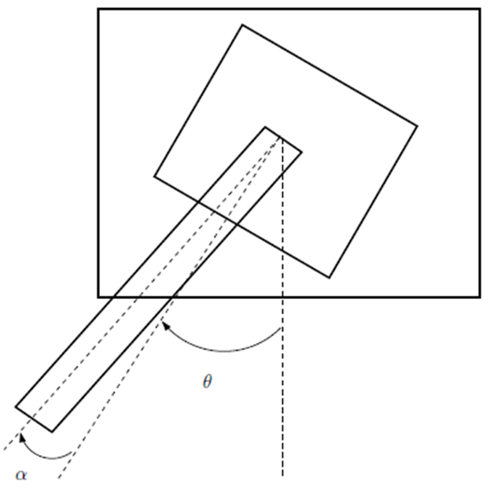

# Нелинейное управление однозвенным гибким манипулятором с шарниром

В данной работе представлен вариант решения задачи, предложенной в [статье](https://github.com/LeoKhariton/nonlinear-control-of-flexible-joint-robotic-arm/blob/main/Modeling%20and%20Nonlinear%20Control%20of%20a%20Single-link%20Flexible%20Joint.pdf).

Математическая модель однозвенного гибкого манипулятора с шарниром в вертикальной плоскости, взятая из [статьи](https://github.com/LeoKhariton/nonlinear-control-of-flexible-joint-robotic-arm/blob/main/Modeling%20and%20Nonlinear%20Control%20of%20a%20Single-link%20Flexible%20Joint.pdf), имеет вид:

$
\begin{cases}
\dot{x_1} = x_3 \\
\dot{x_2} = x_4 \\
\dot{x_3} = \dfrac{K_s}{J_h} x_2 - \dfrac{K_m^2 K_g^2}{R_m J_h} x_3 + \dfrac{K_m K_g}{R_m J_h} v \\
\dot{x_4} = -\dfrac{K_s}{J_h} x_2 + \dfrac{K_m^2 K_g^2}{R_m J_h} x_3 - \dfrac{K_m K_g}{R_m J_h} v - \dfrac{K_s}{J_l} x_2 + \dfrac{mgh}{J_l} \sin(x_1 + x_2)
\end{cases}
$

где

$
\begin{cases}
\theta=x_1\\
\alpha=x_2\\
\dot\theta=x_3\\
\dot\alpha=x_4
\end{cases}
$

Параметры системы:

| Параметр | Обозначение | Величина |
|---|---|---|
| Жёсткость пружины | $K_s$ | 1.61 [Н/м] |
| Инерция | $J_h$ | 0.0021 [кг·м²] |
| Масса звена | $m$ | 0.403 [кг] |
| Ускор. своб. пад. | $g$ | -9.81 [Н/м] |
| Высота | $h$ | 0.06 [м] |
| Конст. двигателя | $K_m$ | 0.00767 [Н/рад/с] |
| Передаточное число | $K_g$ | 70 |
| Инерция нагрузки | $J_l$ | 0.0059 [Кг·м²] |
| Сопротивление двиг. | $R_m$ | 2.6 [Ом] |

1. Поиск линеаризующего управления в `Mathematica`:

Согласно алгоритму, описанному в [книге](https://github.com/LeoKhariton/nonlinear-control-of-flexible-joint-robotic-arm/blob/main/Б.Т.%20Поляк%20М.В.%20Хлебников%20Л.Б.%20Рапопорт.%20Математическая%20теория%20автоматического%20управления.pdf) (стр. 359-361), найдено линеаризующее управление:

$u=\dfrac{\left(g h J_h m R_m \left(\sin (x_1+x_2) \left(-g h m \cos (x_1+x_2)+J_l (x_3+x_4)^2+K_s\right)+K_s x_2 \cos (x_1+x_2)\right)+K_s \left(J_l K_g^2 K_m^2 x_3-K_s R_m x_2 (J_h+J_l)\right)\right)-J_h J_l R_m \left(k_3 (g h m (x_3+x_4) \cos (x_1+x_2)-K_s x_4)+k_2 (g h m \sin (x_1+x_2)-K_s x_2)+y J_l k_0+J_l k_1 (x_3+x_4)\right)}{J_l K_g K_m K_s}$

2. После линеаризации системы можем применить методы линейной теории для поиска коэффициентов $k_0,k_1,k_2,k_3$.